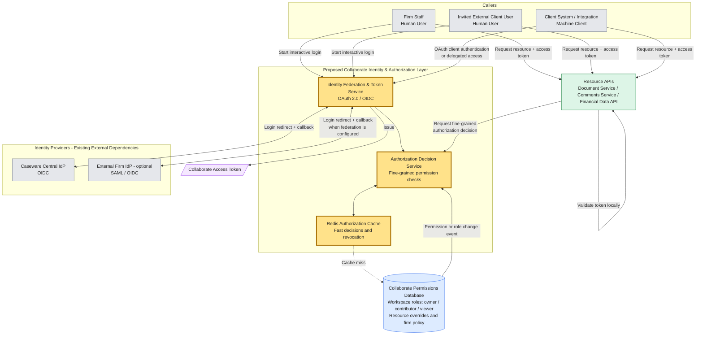

# Caseware Collaborate Authentication & Authorization Assessment

**Created by:** Nicolás Salinas  
**GitHub:** [jnsalinas](https://github.com/jnsalinas)  
**Email:** [jnsalinasgo@gmail.com](mailto:jnsalinasgo@gmail.com)  
**LinkedIn:** [linkedin.com/in/jnsalinasgo](https://www.linkedin.com/in/jnsalinasgo)

Take-home assessment for designing authentication, authorization, and delegated access for Caseware Collaborate.

This project proposes an identity and authorization layer for Caseware Collaborate.

The highlighted yellow components in the architecture diagram are the components proposed in this assessment.

# Part 1: Architecture & Design (Primary Focus)

## 1. Architecture Components

### High-Level Architecture Diagram

The diagram below shows the main callers, the proposed Collaborate Identity & Authorization Layer, existing identity providers, permission storage, and resource APIs.

1. **Callers**

   Collaborate supports three types of callers:

   - **Firm Staff**: internal human users from a Caseware firm.
   - **Invited External Client Users**: external human users invited to a workspace.
   - **Client System / Integration**: a client company's system that calls Collaborate APIs without being a human user.

2. **Collaborate Identity & Authorization Layer**

   This is the main component proposed in this assessment.

   It is responsible for identity federation, token issuance, authorization decisions, and permission revocation.

   The layer starts the login process and identifies the tenant or firm. It then selects the correct Identity Provider.

   - Firm staff authenticate through the **Caseware Central IdP**.
   - External users can authenticate through an **External Firm IdP** when federation is configured.
   - Client systems use OAuth client authentication or delegated access.

   After successful authentication, the layer validates the identity response, maps the identity to a Collaborate user and tenant, and issues a short-lived Collaborate access token.

3. **Identity Providers**

   Identity Providers authenticate users. They are existing external dependencies and are not built by this solution.

   - **Caseware Central IdP** uses OIDC and authenticates firm staff.
   - **External Firm IdP** uses SAML or OIDC and authenticates users from configured external firms.

   Collaborate uses login redirects and callbacks to integrate with these providers.

4. **Redis Authorization Cache**

   Redis is part of the proposed solution.

   It stores recent permission decisions, allowing the system to handle a large number of authorization checks without querying the database for every request.

   Redis also supports quick permission revocation. When a user is removed from a workspace, the related cached permissions are invalidated.

5. **Collaborate Permissions Database**

   The Permissions Database is the source of truth for authorization data.

   It stores:

   - Workspace roles: `owner`, `contributor`, and `viewer`.
   - Resource-level permission overrides.
   - Firm-level policies.

   If Redis does not contain a permission decision, the authorization layer reads the required information from this database and stores the result in Redis.

6. **Collaborate Access Token**

   After authentication, the Identity & Authorization Layer issues a short-lived Collaborate access token and returns it to the caller.

   The token includes information such as the user, tenant, scopes, audience, and expiration time.

7. **Resource Request and Resource APIs**

   The caller uses the Collaborate access token to request a protected resource.

   The Resource APIs include:

   - Document Service.
   - Comments Service.
   - Financial Data API.

   Each Resource API validates the access token locally. It then requests a fine-grained authorization decision from the Authorization Decision Service.

   The API returns the resource when access is allowed. Otherwise, it returns `403 Forbidden`.

## 2. Implementation Plan

The implementation plan defines a structured approach for designing, building, testing, and releasing the proposed identity and authorization solution.

1. **Requirements and Scope Definition**

   Define functional requirements, non-functional requirements, assumptions, security boundaries, and out-of-scope items.

2. **Solution Design**

   Define the high-level architecture, API contracts, tenant routing, token claims, permission model, and Redis caching approach.

3. **Prioritization and Delivery Planning**

   Prioritize the core login, token validation, and resource authorization flow first. Estimate work in small incremental deliveries.

4. **Team and Responsibilities**

   Assign backend, identity/security, platform, and QA responsibilities as required for a production implementation.

5. **Project Setup and Development**

   Create the ASP.NET Core project, configure authentication and authorization, implement the selected APIs, and add Redis and database integrations.

6. **Testing and Quality Validation**

   Perform unit, integration, security, performance, and end-to-end tests. Validate authentication, authorization, caching, revocation, tenant isolation, and delegated access.

7. **Release and Production Readiness**

   Configure secrets, monitoring, audit logs, alerts, deployment pipelines, and a phased production rollout.

## 3. Testing Strategy

The testing strategy checks that users can authenticate, access only allowed resources, and lose access quickly when permissions change.

1. **Unit Tests**

   Test roles, scopes, resource overrides, and firm policies.

2. **Authentication Tests**

   Test valid, expired, and invalid tokens.

   Invalid tokens return `401 Unauthorized`. Valid tokens without permission return `403 Forbidden`.

3. **Integration Tests**

   Test login callbacks, PKCE validation, token issuance, and protected resource endpoints.

4. **Cache and Revocation Tests**

   Test Redis cache hits, cache misses, and database fallback.

   Verify that a user loses access within seconds after removal from a workspace.

5. **Delegated Access Tests**

   Verify that delegated tokens are short-lived and cannot have more permissions than the original user.

6. **Performance Tests**

   Test that permission checks remain fast under high request volume.

## 4. Evaluation & Observability

The system should be monitored to confirm that authentication and authorization are working correctly and performing well.

- Track successful and failed login attempts.
- Track `401 Unauthorized` and `403 Forbidden` responses.
- Track token validation failures and expired tokens.
- Measure authorization decision latency and Redis cache hit rate.
- Monitor permission revocation time after a role or permission change.
- Record audit logs for user actions, client systems, delegated access, and permission changes.
- Create alerts for unusual authentication failures, cache failures, or delayed permission events.

## 5. Failure Modes & Tradeoffs

- **Redis cache** improves authorization performance but can temporarily contain stale permission decisions. Permission-change events and short-lived tokens reduce this risk.

- **Short-lived access tokens** reduce the impact of token theft but require more frequent token renewal.

- **External IdP federation** improves the user login experience but adds tenant-specific configuration and operational complexity.

- **A central Authorization Decision Service** keeps permission rules consistent across Resource APIs but adds a network dependency.

- If Redis is unavailable, the system can use a controlled database fallback or deny sensitive access.

- If a permission event is delayed, access may remain valid briefly. Monitoring and short-lived tokens reduce the impact.

- If an Identity Provider is unavailable, new login attempts fail, while users with valid tokens can continue until token expiration.

# Part 2: Targeted Implementation

## A. API Prototype — JWT Authentication

A small ASP.NET Core API was implemented to demonstrate JWT authentication and authorization.

**Library:** `Microsoft.AspNetCore.Authentication.JwtBearer`

The API uses the JWT Bearer scheme. Protected endpoints require a valid JWT and the `documents.read` scope.

| Method | Endpoint | Auth | Description |
| --- | --- | --- | --- |
| `GET` | `/api/documents` | JWT Bearer + scope `documents.read` | Returns a success message when the token is valid and authorized |

**Expected responses**

- `200 OK` — valid JWT with scope `documents.read`
- `401 Unauthorized` — missing, invalid, or expired token
- `403 Forbidden` — valid JWT without the required scope

Tokens were generated with `dotnet user-jwts`. Swagger UI is available at `/swagger` to paste the JWT and call the endpoint.

### Evidence

**1. Valid JWT — 200 OK**

**2. Missing / invalid JWT — 401 Unauthorized**

**3. Valid JWT without scope — 403 Forbidden**

