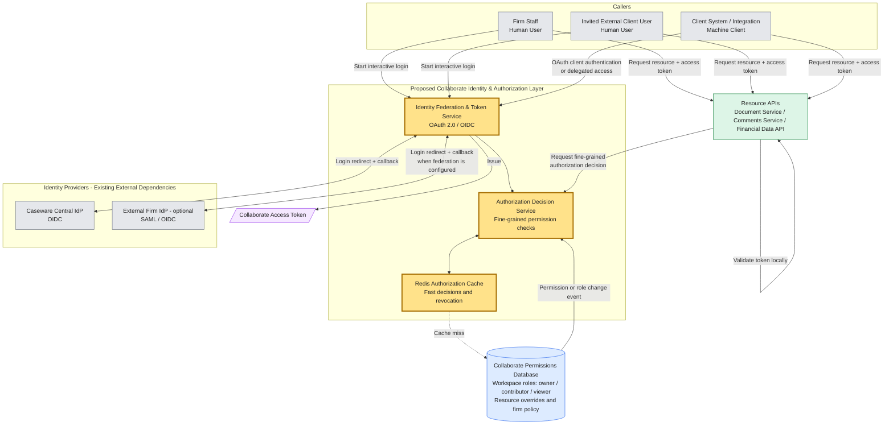
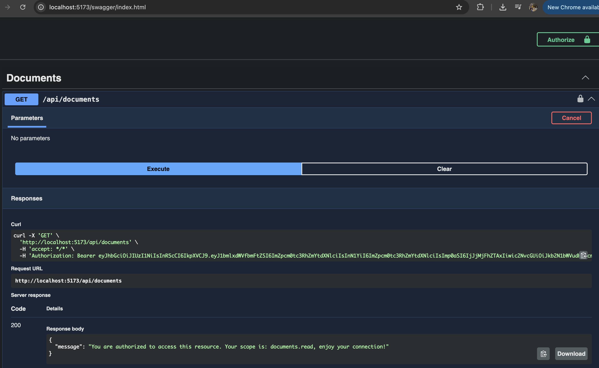
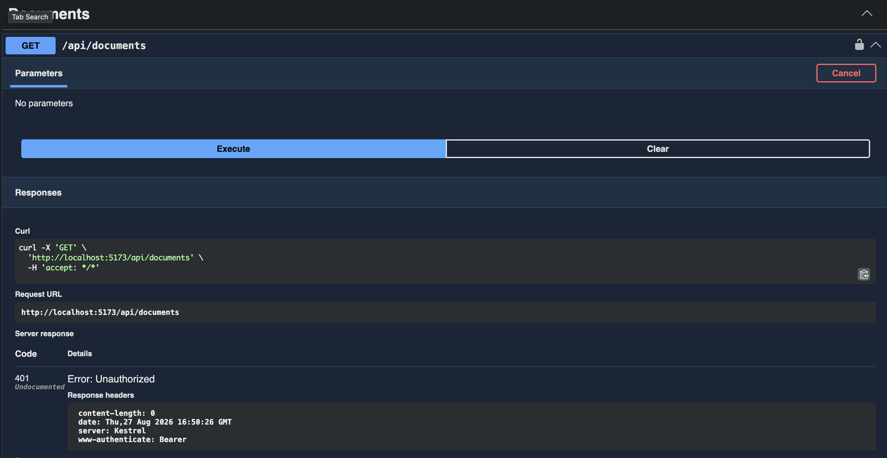
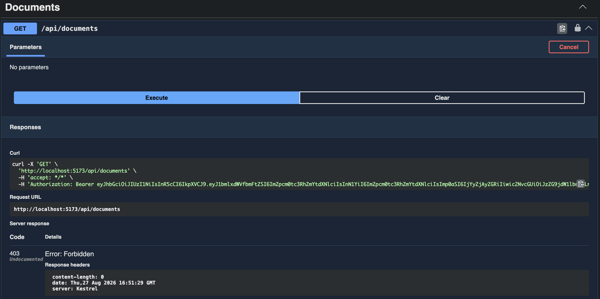

# Caseware Collaborate Authentication & Authorization Assessment

**Created by:** Nicolás Salinas  
**GitHub:** [jnsalinas](https://github.com/jnsalinas)  
**Email:** [jnsalinasgo@gmail.com](mailto:jnsalinasgo@gmail.com)  
**LinkedIn:** [linkedin.com/in/jnsalinasgo](https://www.linkedin.com/in/jnsalinasgo)

This is the design (Part 1) and a small working slice (Part 2). Yellow boxes in the diagram are what I am proposing. The identity providers and the resource APIs already exist — I am not building those.

**Assumptions:** I am not building password storage or MFA. Caseware already has a central login, and some firms can use their own SAML/OIDC login. The permissions database can send events when a role or permission changes. Resource APIs check the token themselves and do not query that database. Redis is available (ElastiCache if this runs on AWS).

# Part 1: Architecture & Design

## 1. High-Level Architecture

Collaborate creates its own short-lived access tokens. Resource APIs use the token to know who the caller is and what they are allowed to do at a high level (scopes). For document, workspace, or firm rules, they ask the Authorization Decision Service.

**Login.** People log in with Authorization Code + PKCE (the usual safe browser flow). The token service looks up the firm. Staff go to Caseware's central login. Invited users go to their firm's login when that is set up. Each firm has its own settings (redirect URLs, IdP details). I would not pass the IdP token into the resource APIs. The IdP does not know about Collaborate workspaces, so we create a Collaborate token with the user, the firm, scopes, audience, and expiry.

**Permission checking.** We cannot hit the database on every request. The Decision Service checks Redis first. If the answer is not there, it loads the role (`owner` / `contributor` / `viewer`), any document-level exceptions, and firm rules from the database, then stores that in Redis. When a permission changes, an event clears the related cache. Access can be taken away in seconds even if the token is still valid.

**Long-lived sessions.** If someone is already editing a document, clearing Redis is not enough. The same event should tell the API to check again or close that connection. Short-lived tokens still limit the damage if an event is late.

**On-behalf-of.** Two cases: a client's system calling Collaborate for one of their employees, and an internal service calling another Caseware API after a user did something. In both cases we swap tokens: the caller gets a new, smaller token for that user, for that API, with fewer scopes. The new token cannot have more access than the user. That stops a service from doing something the user is not allowed to do (confused deputy). We still log who acted and on whose behalf.

## 2. Implementation Plan

1. Token service: PKCE login, send each firm to the right IdP, issue Collaborate tokens.
2. Decision service + Redis + events when permissions change (clear cache and close open sessions).
3. Resource APIs: check the JWT, then ask the Decision Service — this is the Part 2 slice.
4. On-behalf-of token swap, limited to that user and that API.

## 3. Testing Strategy

- Missing, bad, or expired tokens return `401`. A good token without permission or the right scope returns `403`.
- Mix of workspace roles, one-document exceptions, and firm rules.
- Redis hit and miss. After we remove a user, they lose access within seconds — including if they still have a document open.
- Swapped tokens expire soon and cannot have more access than the original user.
- Permission checks stay fast when most answers come from Redis.

## 4. Evaluation & Observability

- Watch login success and failure, `401` / `403` counts, and bad tokens.
- How long a permission check takes, and how often Redis has the answer.
- How long it takes to actually deny access after a permission change, including closing live sessions.
- Audit logs: who did what, for whom, on which resource, and when permissions changed.
- Alerts if logins start failing a lot, Redis is down, or permission events are late.

## 5. Failure Modes & Tradeoffs

- Redis might still say "yes" for a few seconds after we remove someone. Short-lived tokens and closing live sessions make that window small. If Redis is down, deny access to sensitive data, or ask the database with a short timeout.
- Short-lived tokens are safer if a token is stolen, but clients have to refresh more often.
- One Decision Service keeps the rules the same across APIs, but it is another call on the network. Redis and local JWT checks help.
- Letting a firm use its own login is nicer for users, but more work to set up per firm.
- If an IdP is down, new logins fail. People with a valid Collaborate token can keep working until it expires.
- The swapped token must be for that API only, and cannot go beyond the user. If a service token is reused as a user token, a service could act with too much power. We do not allow that.

# Part 2: Targeted Implementation

## Slice A — Resource endpoint with scope check

I built **A** only (not B or C): an API that returns the resource only if the JWT has the right scope, and rejects it otherwise. That is the first thing Document, Comments, and Financial Data APIs need. Workspace-level checks and on-behalf-of tokens stay in the Part 1 design.

**Approach:** I used ASP.NET Core `JwtBearer` and an authorization policy. This is a framework feature, not custom JWT parsing.

**Why:** The middleware already checks the signature, issuer, audience, and expiry. The `DocumentRead` policy requires a logged-in user and `scope = documents.read`. That gives the right answers: no token or a bad token → `401`; a good token without the scope → `403`.

**Tradeoffs:** This does not handle unusual token formats. That is fine here. This slice also does not call the Decision Service. A real Document API would check the JWT first, then ask the Decision Service about the document and workspace. Writing our own JWT crypto would be the wrong use of 2–3 hours.

**Stub:** Tokens come from `dotnet user-jwts`, as a stand-in for the Collaborate token service. There is no real identity provider.

| Method | Endpoint | Auth | Description |
| --- | --- | --- | --- |
| `GET` | `/api/documents` | JWT Bearer + `documents.read` | Success when the token is valid and has the right scope |

- `200 OK` — valid JWT with `documents.read`
- `401 Unauthorized` — missing, invalid, or expired token
- `403 Forbidden` — valid JWT without the required scope

**Run:** `dotnet run --project Collaborate.Authorization.Api`, open `/swagger`, paste a JWT created with `dotnet user-jwts`.

### Validation

**1. Valid JWT — 200 OK**

**2. Missing / invalid JWT — 401 Unauthorized**

**3. Valid JWT without scope — 403 Forbidden**

# AI usage

- AI helped with the README layout, the Mermaid diagram, and the JwtBearer/Swagger setup.
- I kept the design choices (PKCE, Redis, closing live sessions, token swap / confused deputy, slice A only). I did not let it grow Part 2 into a full login system or custom JWT code.
- I would let people use AI for wiring and docs, then check the auth behavior myself: `401` vs `403`, and that a swapped token never has more access than the user.
- Do not trust AI for crypto, permission rules, or shortcuts like sending the IdP token straight into the resource APIs.
