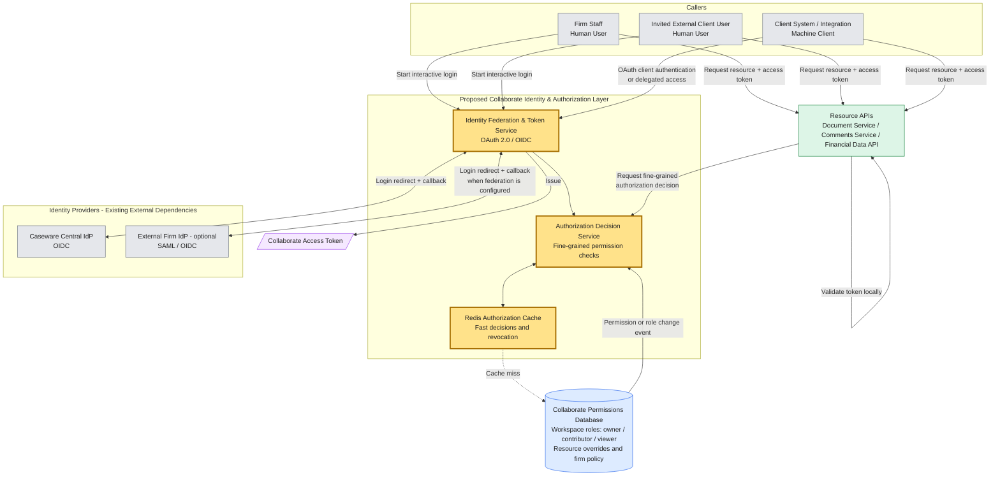

# Caseware Collaborate Authentication & Authorization Assessment

**Created by:** Nicolás Salinas  
**GitHub:** [jnsalinas](https://github.com/jnsalinas)  
**Email:** [jnsalinasgo@gmail.com](mailto:jnsalinasgo@gmail.com)  
**LinkedIn:** [linkedin.com/in/jnsalinasgo](https://www.linkedin.com/in/jnsalinasgo)

Design document (Part 1) and one implementation slice (Part 2) for Collaborate's identity and authorization layer. Yellow boxes in the diagram are proposed here; IdPs and Resource APIs are existing dependencies.

**Assumptions:** We do not build password storage or MFA. Caseware Central IdP and optional firm SAML/OIDC IdPs already exist. The permissions database can emit change events. Resource APIs validate tokens locally and do not query that database. Redis is available (ElastiCache in AWS).

# Part 1: Architecture & Design

## 1. High-Level Architecture

Collaborate issues its own short-lived access tokens. Resource APIs trust those tokens for identity and coarse scopes, then call the Authorization Decision Service for fine-grained checks (workspace role, resource override, firm policy).

**Login.** Authorization Code + PKCE. The token service resolves the firm and routes staff to Caseware Central IdP (OIDC), or invited users to a federated firm IdP (SAML/OIDC) when configured. Per-firm client settings (redirect URIs, IdP metadata) live with the token service. We do not forward the IdP JWT to Resource APIs. Collaborate membership and permissions are not in the IdP, so we mint a Collaborate token with `sub`, tenant, scopes, `aud`, and expiry.

**Permission checking.** Checks cannot hit the database on every request. The Decision Service reads Redis first; on miss it loads roles (`owner` / `contributor` / `viewer`), resource overrides, and firm policy from the database and caches the result. Permission-change events invalidate related keys so revocation takes effect in seconds while the access token may still be valid.

**Long-lived sessions.** An open editing connection may already have been authorized. Cache invalidation is not enough by itself: the same events tell the Resource API to re-check or drop the connection. Short-lived tokens still bound the window if an event is delayed.

**On-behalf-of.** Two cases: a client system calling Collaborate for one of their employees, and an internal service calling another Caseware API after a user action. Both use token exchange: the caller gets a new, narrower token bound to that user, a specific `aud`, and a subset of scopes. The new token cannot exceed the original user's permissions (confused deputy). Downstream calls stay attributable (`act` + `sub`) for audit.

## 2. Implementation Plan

1. Token service: PKCE login, firm → IdP routing, Collaborate access tokens.
2. Decision service + Redis + permission-change events (cache invalidation and live-session drop).
3. Resource APIs: JWT validation + decision-service call — the slice in Part 2.
4. On-behalf-of token exchange, scoped and audience-bound.

## 3. Testing Strategy

- Missing, invalid, or expired tokens return `401`. A valid token without permission or scope returns `403`.
- Workspace role, resource override, and firm policy combinations.
- Cache hit/miss, and loss of access within seconds after removal — including an open collaborative session.
- Exchanged tokens are short-lived and cannot be broader than the original user.
- Decision latency stays low when most checks are Redis hits.

## 4. Evaluation & Observability

- Login success/failure, `401` / `403` rates, token validation failures.
- Decision latency and Redis hit rate.
- Time from permission change to effective deny, including dropped live sessions.
- Audit: who acted, on behalf of whom, on which resource; permission changes.
- Alerts: auth-failure spikes, cache unavailability, delayed permission events.

## 5. Failure Modes & Tradeoffs

- Redis can serve a stale allow until invalidation arrives. Short-lived tokens and live-session drop shrink that window. If Redis is down, fail closed on sensitive resources or fall back to the database with a tight timeout.
- Short-lived tokens limit theft and stale grants, at the cost of more refresh traffic.
- A central Decision Service keeps rules consistent across APIs, at the cost of a network hop (offset by Redis and local JWT validation).
- Firm IdP federation improves login UX and adds per-tenant operational work.
- If an IdP is down, new logins fail; valid Collaborate tokens continue until expiry.
- Token exchange must bind `aud` and cap scopes to the user. Reusing a service token as a user token is the confused-deputy failure we refuse.

# Part 2: Targeted Implementation

## Slice A — Resource endpoint with scope check

I implemented **A** only (not B or C): a Resource API that serves the request only when the JWT has the required scope, and rejects it otherwise. That is the contract Document, Comments, and Financial Data APIs need first. Fine-grained workspace checks and on-behalf-of exchange stay in the Part 1 design.

**Approach:** ASP.NET Core `JwtBearer` plus an authorization policy — a framework feature, not custom JWT parsing or key management.

**Why:** The middleware already validates signature, issuer, audience, and expiry. Policy `DocumentRead` requires an authenticated user and claim `scope = documents.read`. That produces the right contract: no or invalid token → `401`; valid token without the scope → `403`.

**Tradeoffs:** Little control over non-standard tokens, which is acceptable here. This slice does not call the Decision Service; a production Document API would validate the JWT locally, then ask the Decision Service for document/workspace permission. Hand-rolling JWT crypto would be the wrong use of a 2–3 hour budget.

**Stub:** Tokens from `dotnet user-jwts`, standing in for the Collaborate token service. No identity provider.

| Method | Endpoint | Auth | Description |
| --- | --- | --- | --- |
| `GET` | `/api/documents` | JWT Bearer + `documents.read` | Success when the token is valid and authorized |

- `200 OK` — valid JWT with `documents.read`
- `401 Unauthorized` — missing, invalid, or expired token
- `403 Forbidden` — valid JWT without the required scope

**Run:** `dotnet run --project Collaborate.Authorization.Api`, open `/swagger`, paste a JWT created with `dotnet user-jwts`.

### Validation

**1. Valid JWT — 200 OK**

**2. Missing / invalid JWT — 401 Unauthorized**

**3. Valid JWT without scope — 403 Forbidden**

# AI usage

- AI helped with README structure, the Mermaid diagram, and JwtBearer/Swagger boilerplate.
- I kept the design choices (PKCE, Redis invalidation, live-session drop, token exchange / confused deputy, slice A only) and did not expand Part 2 into a full IdP or a custom JWT parser.
- I would let engineers use AI for framework wiring and docs, then review auth contracts, `401` vs `403`, and token-scope reduction myself.
- Do not trust AI for cryptography, permission models, or shortcuts like forwarding the IdP token into Resource APIs.
