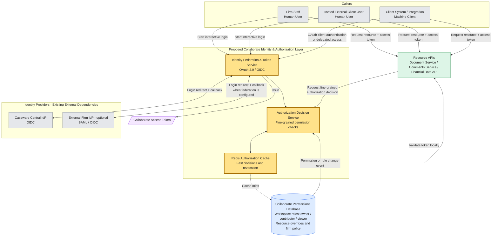

# Caseware Collaborate Authentication & Authorization Assessment

**Created by:** Nicolás Salinas  
**GitHub:** [jnsalinas](https://github.com/jnsalinas)  
**Email:** [jnsalinasgo@gmail.com](mailto:jnsalinasgo@gmail.com)  
**LinkedIn:** [linkedin.com/in/jnsalinasgo](https://www.linkedin.com/in/jnsalinasgo)

Design for Collaborate login and permissions, plus a small API that checks JWTs. Yellow boxes are what I am proposing. Identity providers and resource APIs already exist.

**Assumptions:** I am not building password storage or MFA. Caseware already has a central login, and some firms can use their own SAML/OIDC login. The permissions database can send events when roles change. Resource APIs check the token themselves and do not query that database. Redis is available (ElastiCache on AWS).

# Part 1: Architecture & Design (Primary Focus)

## 1. Architecture Components

### High-Level Architecture Diagram

1. **Callers** — Firm staff, invited external users, and client systems (no human in that call).

2. **Collaborate Identity & Authorization Layer** — Login, tokens, permission checks, and taking access away. Exposes OAuth 2.0 / OIDC (`authorize`, `token`, `discovery`). Calls Caseware IdP discovery/token/userinfo; we do not build those. Each firm has its own client settings.

3. **Identity Providers** — Already exist. Caseware Central IdP (OIDC) for staff. Optional firm SAML/OIDC IdP for invited users.

4. **Redis Authorization Cache** — Recent permission answers, so we do not hit the database on every request (tens of thousands of checks/second). Clearing cache lets us take access away in seconds even if the token is still valid.

5. **Collaborate Permissions Database** — Source of truth: workspace roles (`owner` / `contributor` / `viewer`), one-document exceptions, and firm rules. Redis miss → read DB → cache.

6. **Collaborate Access Token** — Short-lived token with user, firm, scopes, audience, and expiry. We do not pass the IdP token to resource APIs; Collaborate creates its own.

7. **Resource APIs** — Documents, comments, financial data. Each API checks the JWT locally, then asks the Decision Service. If no access → `403 Forbidden`.

**Login.** Authorization Code + PKCE. Staff use Caseware login. Invited users use their firm's login when it is set up.

**Long-lived sessions.** If someone is already editing, clearing Redis is not enough. The same event should tell the API to check again or close that connection. We do not force everyone to log in again.

**On-behalf-of.** A client's system calling for an employee, or an internal service calling another API after a user action. New, smaller token for that user and that API. It cannot have more access than the user (confused deputy). We still log who acted and for whom.

## 2. Implementation Plan

1. **Requirements and Scope** — What we will build, what we will not, and the security limits.
2. **Solution Design** — Architecture, APIs, firm login routing, token claims, permission model, Redis.
3. **Prioritization** — Login, token checks, and resource access first, in small steps.
4. **Team and Responsibilities** — Backend, identity/security, platform, and QA.
5. **Project Setup and Development** — ASP.NET Core project, auth, APIs, Redis, and the database.
6. **Testing** — Unit, integration, security, performance, and end-to-end tests.
7. **Release** — Secrets, monitoring, audit logs, alerts, deploy pipelines, slow rollout.

## 3. Testing Strategy

Prove people can log in, only see what they should, and lose access quickly when permissions change.

1. **Unit Tests** — Roles, scopes, one-document exceptions, firm rules.
2. **Authentication Tests** — Valid, expired, and invalid tokens. Bad token → `401`. Valid token without permission → `403`.
3. **Integration Tests** — Login callbacks, PKCE, token creation, protected endpoints.
4. **Cache and Revocation Tests** — Redis hit/miss, database fallback. After we remove a user, they lose access within seconds — including if they still have a document open.
5. **Delegated Access Tests** — On-behalf-of tokens expire soon and cannot have more access than the original user.
6. **Performance Tests** — Permission checks stay fast under many requests.

## 4. Evaluation & Observability

- Count successful/failed logins, `401` / `403`, and bad or expired tokens.
- Measure how long a permission check takes, and how often Redis has the answer.
- Measure how long it takes to deny access after a permission change, including closing live sessions.
- Audit logs: who did what, for whom, on which resource, and when permissions changed.
- Alert if logins fail a lot, Redis is down, or permission events are late.

## 5. Failure Modes & Tradeoffs

- **Redis** is faster, but it can still say "yes" for a short time after we remove someone. Events, short-lived tokens, and closing live sessions shrink that window.
- **Short-lived tokens** are safer if stolen, but clients refresh more often.
- **A firm's own login** is nicer for users, but more setup per firm.
- **One Decision Service** keeps rules the same across APIs, but it is another network call. Redis and local JWT checks help.
- If Redis is down, ask the database with a short timeout, or deny sensitive access.
- If a permission event is late, access may stay valid briefly. Monitoring and short-lived tokens help.
- If an IdP is down, new logins fail. People with a valid Collaborate token keep working until it expires.
- If a service token is reused as a user token, a service could do more than the user is allowed. Token swap must stay limited to that user and that API.

# Part 2: Targeted Implementation

## A. API Prototype — JWT Authentication

A small ASP.NET Core API that only serves the request when the JWT has the right scope.

**Library:** `Microsoft.AspNetCore.Authentication.JwtBearer`

**Why ASP.NET Core / .NET:** JWT auth and policies are already built in, so I did not write my own JWT parser. A full identity server would be too much for this slice.

I implemented **A** only (not B or C). Policy `DocumentRead` requires `scope = documents.read`. No token or a bad token → `401`. A good token without the scope → `403`.

This slice does not call the Decision Service. `dotnet user-jwts` stands in for the Collaborate token service. There is no real identity provider.

| Method | Endpoint | Auth | Description |
| --- | --- | --- | --- |
| `GET` | `/api/documents` | JWT Bearer + `documents.read` | Success when the token is valid and has the right scope |

- `200 OK` — valid JWT with `documents.read`
- `401 Unauthorized` — missing, invalid, or expired token
- `403 Forbidden` — valid JWT without the required scope

**Run:** `dotnet run --project Collaborate.Authorization.Api`, open `/swagger`, paste a JWT from `dotnet user-jwts`.

### Evidence

**1. Valid JWT — 200 OK**

**2. Missing / invalid JWT — 401 Unauthorized**

**3. Valid JWT without scope — 403 Forbidden**

# AI usage

- AI helped with the README layout, the Mermaid diagram, and the JwtBearer/Swagger setup.
- I kept the design choices (PKCE, Redis, closing live sessions, token swap, slice A only). I did not turn Part 2 into a full login system.
- I would let people use AI for wiring and docs, then check `401` vs `403` myself, and that a swapped token never has more access than the user.